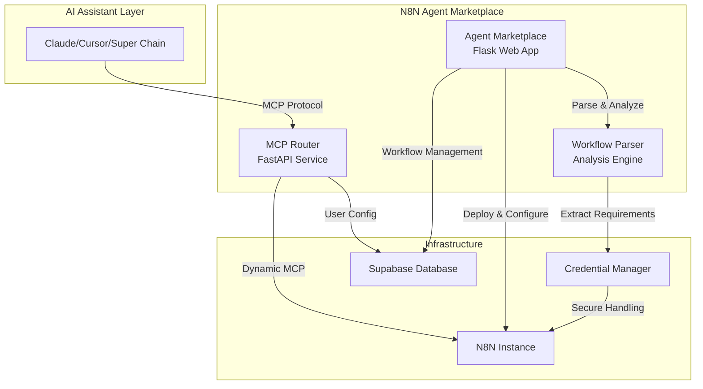

# N8N Agent Marketplace

**Transform your N8N workflows into AI-powered tools instantly**

A comprehensive platform that converts N8N workflows into Model Context Protocol (MCP) servers, enabling seamless integration with AI assistants like Claude, Cursor, and other MCP-compatible platforms. Build powerful automation tools using N8N's visual workflow editor and deploy them as callable AI functions.

## 🚀 Demo 
[Live Demo](https://p2rdr5jbej.us-east-1.awsapprunner.com/)


## 🎯 Key Features

### 🤖 **MCP Server Creation**
Convert your N8N workflows into MCP servers that AI assistants can use as custom tools

### 🔄 **Dual Architecture**
- **Agent Marketplace**: Web-based workflow management and deployment platform
- **MCP Router**: High-performance MCP server creation and routing system

### 🛠️ **Comprehensive Workflow Management**
- Browse and deploy pre-built workflow templates
- Upload and manage your custom N8N workflows
- Real-time credential configuration and testing
- One-click deployment to your N8N instance

### 🔐 **Enterprise-Grade Security**
- Zero server-side credential storage
- Secure credential transmission during deployment
- Isolated MCP instances per user/workflow
- Row-level security with Supabase

### 📊 **Smart Workflow Analysis**
- Automatic detection of 50+ N8N node types
- Dynamic form generation for required credentials
- Workflow complexity metrics and validation
- Duplicate deployment prevention

## 🏗️ Architecture



## 📦 Installation

### Prerequisites
- **Python 3.11+**
- **N8N Instance** (cloud.n8n.io or self-hosted)
- **Supabase Account** (for data storage)
- **Docker** (optional, for containerized deployment)

### Quick Start

1. **Clone the repository**
   ```bash
   git clone https://github.com/Super-Chain/N8N-Agent-Marketplace.git
   cd N8N-Agent-Marketplace
   ```

2. **Set up Agent Marketplace**
   ```bash
   cd agent_marketplace
   pip install -r requirements.txt
   python app.py
   ```
   Access at: http://localhost:5000

3. **Set up MCP Router** (in separate terminal)
   ```bash
   cd mcp_router
   pip install -e .
   playwright install  # For N8N authentication
   python mcp_router.py
   ```
   Service available at: http://localhost:6545

### Environment Configuration

Create `.env` files in both directories:

#### agent_marketplace/.env
```env
# Flask Configuration
FLASK_SECRET_KEY=your-secret-key

# Supabase Database
SUPABASE_URL=https://your-project.supabase.co
SUPABASE_KEY=your-supabase-anon-key

# N8N Integration
N8N_BASE_URL=https://your-n8n-instance.com
X_N8N_API_KEY=your-n8n-api-key

# MCP Router (optional)
N8N_BUILDER_URL=http://localhost:6545
```

#### mcp_router/.env
```env
# N8N Configuration
N8N_INSTANCE_URL=https://your-n8n-instance.com
N8N_API_KEY=your-n8n-api-key
N8N_USERNAME=your-n8n-username
N8N_PASSWORD=your-n8n-password

# Supabase Configuration
SUPABASE_URL=https://your-project.supabase.co
SUPABASE_KEY=your-supabase-service-key

# Server Configuration
PORT=6545
HOST=0.0.0.0
```

## 🔧 Usage

### Creating MCP Servers from N8N Workflows

1. **Upload Workflow**: Use the Agent Marketplace to upload your N8N workflow JSON
2. **Configure Credentials**: Fill in required API keys and service credentials
3. **Deploy to N8N**: One-click deployment creates the workflow in your N8N instance
4. **Generate MCP Server**: Use the MCP Router to create a callable MCP server
5. **Integrate with AI**: Add the MCP server to your AI assistant configuration

### Example: Creating a Data Processing Tool

```bash
# 1. Register workflow with MCP Router
curl -X POST "http://localhost:6545/n8n/build" \
  -H "Content-Type: application/json" \
  -d '{
    "workflow_id": "data_processor_123",
    "user_apikey": "your_unique_key"
  }'

# 2. Configure Claude Desktop to use the MCP server
# Add to claude_desktop_config.json:
{
  "mcpServers": {
    "data_processor": {
      "command": "npx",
      "args": [
        "@modelcontextprotocol/server-fetch",
        "http://localhost:6545/mcp/data_processor_123/your_unique_key"
      ]
    }
  }
}
```

## 🎨 Use Cases

### 🔍 **Data Processing & Analysis**
- Transform CSV/Excel files using N8N's data manipulation nodes
- Connect to databases and APIs for real-time data analysis
- Generate reports and visualizations from AI conversations

### 🌐 **API Integration Hub**
- Connect AI assistants to external services (Slack, Google, etc.)
- Create custom API endpoints for proprietary systems
- Build unified interfaces for multiple SaaS platforms

### 📧 **Communication & Notifications**
- Send emails, Slack messages, or Discord notifications
- Create automated reporting systems
- Build alert systems triggered by AI interactions

### 🔄 **Workflow Automation**
- Trigger complex business processes from AI conversations
- Create approval workflows and task management systems
- Build custom integrations with enterprise systems

## 🛠️ Development

### Project Structure

```
N8N-Agent-Marketplace/
├── agent_marketplace/              # Flask web application
│   ├── app.py                     # Main Flask app with API endpoints
│   ├── database.py                # Supabase integration
│   ├── n8n_workflow_parser.py     # Workflow analysis engine
│   ├── requirements.txt           # Python dependencies
│   ├── templates/                 # HTML templates
│   └── static/                    # CSS/JS/assets
├── mcp_router/                    # FastAPI MCP service
│   ├── mcp_router.py              # Main FastAPI application
│   ├── n8n_credential_extractor.py # N8N authentication
│   ├── secret_manager.py          # Credential management
│   ├── n8n_mcp.py                # MCP server template
│   └── pyproject.toml             # Python dependencies
└── README.md                      # This documentation
```

### Running Tests

```bash
# Agent Marketplace
cd agent_marketplace
python -m pytest tests/

# MCP Router
cd mcp_router
python -m pytest tests/
python test_mcp_router.py
```

### Docker Deployment

```bash
# Build and run Agent Marketplace
cd agent_marketplace
docker build -t agent-marketplace .
docker run -p 5000:5000 --env-file .env agent-marketplace

# Build and run MCP Router
cd mcp_router
docker build -t mcp-router .
docker run -p 6545:6545 --env-file .env mcp-router
```

## 🚀 Production Deployment

### Using Docker Compose

```yaml
version: '3.8'
services:
  agent-marketplace:
    build: ./agent_marketplace
    ports:
      - "5000:5000"
    environment:
      - FLASK_ENV=production
      - SUPABASE_URL=${SUPABASE_URL}
      - SUPABASE_KEY=${SUPABASE_KEY}
      - N8N_BASE_URL=${N8N_BASE_URL}
      - X_N8N_API_KEY=${X_N8N_API_KEY}
    restart: unless-stopped

  mcp-router:
    build: ./mcp_router
    ports:
      - "6545:6545"
    environment:
      - N8N_INSTANCE_URL=${N8N_INSTANCE_URL}
      - N8N_API_KEY=${N8N_API_KEY}
      - SUPABASE_URL=${SUPABASE_URL}
      - SUPABASE_KEY=${SUPABASE_KEY}
    restart: unless-stopped
```

### Database Setup

1. **Create Supabase Project**: Set up a new project at [supabase.com](https://supabase.com)
2. **Run Migrations**: Execute the SQL scripts in `agent_marketplace/`
3. **Configure RLS**: Set up Row Level Security policies for user data isolation

## 🔐 Security Best Practices

- **Credential Management**: Never store user credentials server-side
- **API Key Rotation**: Regularly rotate N8N API keys and Supabase keys
- **Network Security**: Use HTTPS in production with proper SSL certificates
- **Access Control**: Implement proper authentication and authorization
- **Data Isolation**: Ensure proper user data segregation with RLS policies

## 📚 API Documentation

### Agent Marketplace API
- `POST /api/parse-workflow` - Analyze N8N workflow
- `POST /api/deploy-workflow-to-n8n` - Deploy to N8N instance
- `GET /api/marketplace/workflows` - Browse available workflows
- `POST /api/auth/login` - User authentication

### MCP Router API
- `POST /n8n/build` - Register workflow as MCP server
- `GET /list` - List registered MCP servers
- `POST /remove/{workflow_id}/{user_key}` - Remove MCP registration
- `mcp://{host}:{port}/mcp/{workflow_id}/{user_key}` - MCP server endpoint

## 🤝 Contributing

1. **Fork the repository**
2. **Create a feature branch**: `git checkout -b feature/amazing-feature`
3. **Commit your changes**: `git commit -m 'Add amazing feature'`
4. **Push to the branch**: `git push origin feature/amazing-feature`
5. **Open a Pull Request**

## 📄 License

This project is licensed under the MIT License - see the [LICENSE](LICENSE) file for details.

## 🆘 Support

- **Issues**: [GitHub Issues](https://github.com/Super-Chain/N8N-Agent-Marketplace/issues)
- **Documentation**: Check component-specific READMEs in `/agent_marketplace/` and `/mcp_router/`
- **Community**: Join our community discussions

## 🙏 Acknowledgments

- [N8N](https://n8n.io/) for the amazing workflow automation platform
- [Model Context Protocol](https://modelcontextprotocol.io/) for enabling AI tool integration
- [Supabase](https://supabase.com/) for the robust database infrastructure
- [FastAPI](https://fastapi.tiangolo.com/) and [Flask](https://flask.palletsprojects.com/) for the web frameworks

---

**Built with ❤️ by the SUPERCHAIN team for the AI automation community**
