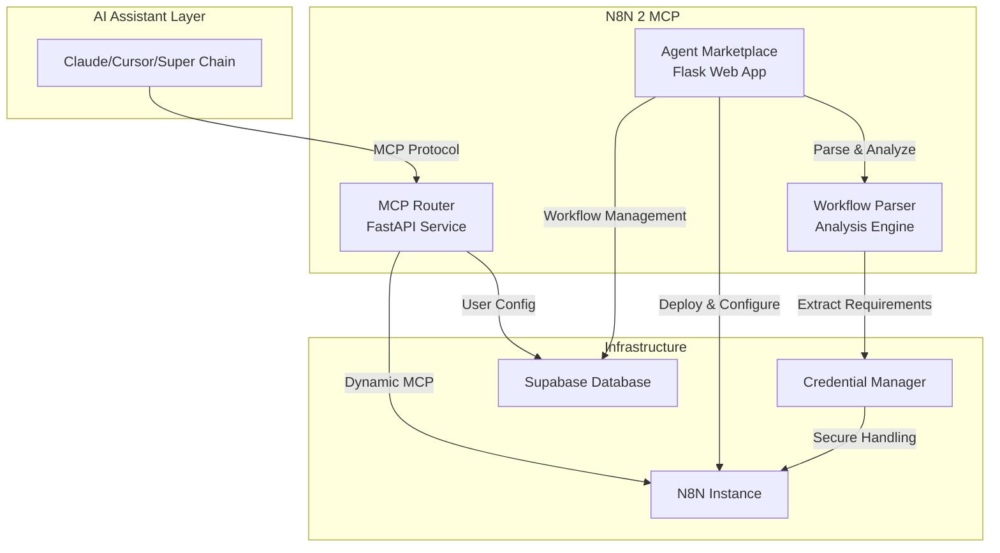

<a href="https://www.producthunt.com/products/n8n2mcp-n8n-workflow-into-mcp-servers?embed=true&utm_source=badge-featured&utm_medium=badge&utm_source=badge-n8n2mcp" target="_blank"></a>

#### Transform your N8N workflows into MCP servers instantly 

A comprehensive platform that converts N8N workflows into Model Context Protocol (MCP) servers, enabling seamless integration with AI assistants like Claude, Cursor, and other MCP-compatible platforms. Build powerful automation tools using N8N's visual workflow editor and deploy them as callable AI functions.


## ✨ How to use 

1. Copy the N8N template link/JSON from any workflow
   
2. Map your credentials through our intuitive interface
   
3. Deploy with one click!

**Your N8N workflow gets deployed and creates a local hosted MCP server. Just paste the server URL into Claude, Cursor, Super Chain, or any MCP-compatible platform!**

## 🎯 Key Features

### 🤖 **MCP Server Creation**
Convert your N8N workflows into MCP servers that AI assistants can use as custom tools

### 🔄 **Dual Architecture**
- **Agent Marketplace**: Web-based workflow management and deployment platform
- **MCP Router**: High-performance MCP server creation and routing system

### 🛠️ **Comprehensive Workflow Management**
- Browse and deploy pre-built workflow templates
- Upload and manage your custom N8N workflows
- Real-time credential configuration and testing
- One-click deployment to your N8N instance

## 🏗️ Architecture



## 📦 Installation

### Prerequisites
- **Python 3.11+**
- **N8N Instance** (cloud.n8n.io or self-hosted)
- **Supabase Account** (for data storage)
- **Playwright** (required for N8N authentication)
- **Docker** (optional, for containerized deployment)

> ⚠️ **Important**: Playwright installation is **required** for N8N workflow execution. The system will use dummy credentials if Playwright is not properly installed, limiting functionality.

### Quick Start

1. **Clone the repository**
   ```bash
   git clone https://github.com/Super-Chain/N8N2MCP.git
   cd N8N2MCP
   ```

2. **Install dependencies**
   ```bash
   pip install -r requirements.txt
    ```

3. **Install Playwright browsers** (Required)
   ```bash
   playwright install
   # This downloads the necessary browser binaries for N8N authentication
   ```

4. **Configure environment**
   ```bash
   # Copy and edit the .env file (see Environment Configuration section)
   cp .env.example .env
   # Edit .env with your actual configuration values
   ```
    ```.env
    # Supabase Configuration
    SUPABASE_URL=https://your-project-id.supabase.co
    SUPABASE_KEY=your_supabase_anon_key
    SUPABASE_SERVICE_KEY=your_supabase_service_role_key
    
    # N8N Configuration
    X_N8N_API_KEY=your_n8n_api_key
    N8N_BASE_URL=https://your-n8n-instance.com
    N8N_USERNAME=your_n8n_username
    N8N_PASSWORD=your_n8n_password
    
    # MCP Router Configuration
    N8N_BUILDER_URL=http://localhost:6545
    
    # Server Configuration
    FLASK_HOST=0.0.0.0
    FLASK_PORT=5000
    MCP_HOST=0.0.0.0
    MCP_PORT=6545
    
    # Optional: Authentication credentials (auto-populated)
    N8N_AUTH=
    N8N_BROWSER_ID=   
    ```

5. **Start both servers**
   ```bash
   python main.py
   ```
   This starts:
   - Flask App (Agent Marketplace) at: http://localhost:5000
   - MCP Router at: http://localhost:6545

6. **Access to UI**
   Front end : http://localhost:5000
   

**Configuration Notes:**
- **SUPABASE_URL**: Your Supabase project URL
- **SUPABASE_KEY**: Anon key for client-side operations
- **SUPABASE_SERVICE_KEY**: Service role key for admin operations
- **N8N_BASE_URL**: Your N8N instance URL (must include https://)
- **N8N_BUILDER_URL**: Must include http:// protocol

## 🔧 Usage

### Creating MCP Servers from N8N Workflows

#### Method 1: Import N8N Templates
1. **Browse Templates**: Visit the [N8N template](https://n8n.io/workflows/)
2. **Import Template**: Enter an N8N template URL from n8n.io
3. **Configure Credentials**: Fill in required API keys and service credentials
4. **Deploy Workflow**: Click deploy to create the workflow in your N8N instance
5. **MCP Server Created**: Automatically generates an MCP server endpoint

#### Method 2: Upload Custom Workflows  
1. **Upload JSON**: Upload your N8N workflow JSON file / Copy and paste your JSON workflow
2. **Review Analysis**: Check detected nodes and required credentials
3. **Configure & Deploy**: Fill credentials and deploy to N8N
4. **Access MCP Server**: Use the generated MCP endpoint in AI tools

#### Using MCP Servers
```bash
# Example MCP server URL format:
http://localhost:6545/mcp/{workflow_id}/{api_key}

# Test MCP server:
curl http://localhost:6545/list  # List all registered MCP servers
```

## 🎨 Use Cases

### 🔍 **Data Processing & Analysis**
- Transform CSV/Excel files using N8N's data manipulation nodes
- Connect to databases and APIs for real-time data analysis
- Generate reports and visualizations from AI conversations

### 🌐 **API Integration Hub**
- Connect AI assistants to external services (Slack, Google, etc.)
- Create custom API endpoints for proprietary systems
- Build unified interfaces for multiple SaaS platforms

### 📧 **Communication & Notifications**
- Send emails, Slack messages, or Discord notifications
- Create automated reporting systems
- Build alert systems triggered by AI interactions

### 🔄 **Workflow Automation**
- Trigger complex business processes from AI conversations
- Create approval workflows and task management systems
- Build custom integrations with enterprise systems

## 🛠️ Development

### Project Structure

```
N8N2MCP/
├── Dockerfile                     # Docker configuration
├── main.py                        # Unified server startup script
├── requirements.txt               # Consolidated Python dependencies
├── .env                          # Environment configuration (shared)
│
├── agent_marketplace/             # Flask web application
│   ├── app.py                    # Main Flask app with API endpoints
│   ├── database.py               # Supabase integration & data models
│   ├── n8n_workflow_parser.py    # Workflow analysis engine
│   ├── setup_supabase.py         # Database setup utilities
│   ├── static/                   # Static assets
│   │   ├── css/                  # CSS files
│   │   │   ├── main.css          # Main stylesheet
│   │   │   └── variables.css     # CSS variables
│   │   └── js/                   # JavaScript files
│   │       ├── api.js            # API abstraction layer
│   │       ├── main.js           # Main application logic
│   │       └── ui.js             # UI management
│   ├── templates/                # HTML templates
│   │   ├── index.html          # Main application entry point
│   │   ├── layout.html         # Base layout
│   │   └── workflows.html      # Workflows page
│   └── __init__.py               # Python package marker
│
├── mcp_router/                   # FastAPI MCP service
│   ├── mcp_router.py             # Main FastAPI application
│   ├── n8n_credential_extractor.py # N8N authentication
│   ├── credential_helper.py       # Credential management utilities
│   └── __init__.py               # Python package marker
│
└── README.md                     # This documentation
```

### Database Setup

The system uses **2 main tables** in Supabase:

#### Setup
1. **Create Supabase Project**: Set up a new project at [supabase.com](https://supabase.com)
2. **Run SQL in Supabase SQL Editor**:

```sql
-- Main workflow storage table
CREATE TABLE IF NOT EXISTS public.user_workflows (
    id UUID DEFAULT gen_random_uuid() PRIMARY KEY,
    user_id TEXT NOT NULL,
    template_id TEXT NOT NULL,
    template_url TEXT NOT NULL,
    workflow_name TEXT NOT NULL,
    workflow_json JSONB NOT NULL,
    workflow_description TEXT,
    n8n_workflow_id TEXT,
    source TEXT DEFAULT 'user_upload',
    credentials_required JSONB DEFAULT '[]'::jsonb,
    mcp_link TEXT,
    status TEXT DEFAULT 'pending',
    created_at TIMESTAMP WITH TIME ZONE DEFAULT NOW(),
    updated_at TIMESTAMP WITH TIME ZONE DEFAULT NOW()
);

-- MCP server configurations
CREATE TABLE IF NOT EXISTS public.mcp_configs (
    id UUID DEFAULT gen_random_uuid() PRIMARY KEY,
    workflow_id TEXT NOT NULL,
    user_apikey TEXT NOT NULL,
    code TEXT NOT NULL,
    created_at TIMESTAMP WITH TIME ZONE DEFAULT NOW(),
    updated_at TIMESTAMP WITH TIME ZONE DEFAULT NOW(),
    UNIQUE(workflow_id, user_apikey)
);

-- Enable Row Level Security (recommended)
ALTER TABLE user_workflows ENABLE ROW LEVEL SECURITY;
ALTER TABLE mcp_configs ENABLE ROW LEVEL SECURITY;
```

## 🚀 Running the System

### Unified Startup (Recommended)
```bash
python main.py
```
This automatically starts both services with:
- ✅ Environment validation
- ✅ Database setup verification  
- ✅ Graceful shutdown handling
- ✅ Centralized logging

### Individual Services

#### Agent Marketplace (Port 5000)
```bash
cd agent_marketplace
python app.py
```

#### MCP Router (Port 6545)  
```bash
cd mcp_router
python mcp_router.py
```

### Verification
```bash
# Test Agent Marketplace
curl http://localhost:5000/api/health

# Test MCP Router
curl http://localhost:6545/list

# View all endpoints
curl http://localhost:5000/api/health | grep endpoints
```

## 🔧 Troubleshooting

### Common Issues

#### Port Already in Use
```bash
# Kill processes on ports 5000 and 6545
fuser -k 5000/tcp 6545/tcp
# Or restart with main.py which handles this automatically
python main.py
```

#### Database Connection Issues
```bash
# Verify Supabase configuration
python -c "from agent_marketplace.database import db_manager; print('✅ Database OK' if db_manager.supabase else '❌ Database connection failed')"

# Reset database tables
python agent_marketplace/setup_supabase.py
```

#### MCP Router Not Responding
```bash
# Check if MCP Router is running
curl http://localhost:6545/list

# View MCP Router logs
# Logs appear in terminal where main.py was started
```

#### N8N Workflow Creation Fails
- Verify `N8N_BASE_URL` includes `https://`
- Check `X_N8N_API_KEY` is valid and has workflow creation permissions
- Ensure N8N instance is accessible from your server

#### Missing Dependencies
```bash
# Install missing packages
pip install playwright
playwright install  # For N8N authentication (required)

# Or install all dependencies
pip install -r requirements.txt
```

#### Playwright Browser Issues
```bash
# If playwright browsers fail to download
playwright install --force

# For headless environments (servers)
playwright install chromium

# Check if playwright is working
python -c "from playwright.async_api import async_playwright; print('✅ Playwright OK')"
```

### Development Tips
```bash
# Enable debug mode for Flask
export FLASK_DEBUG=1

# View detailed MCP Router logs
cd mcp_router && python mcp_router.py --log-level debug

# Test individual components
python -m agent_marketplace.n8n_workflow_parser  # Test parser
python -m mcp_router.mcp_router                  # Test MCP Router
```

## 🔐 Security Best Practices

- **Credential Management**: Never store user credentials server-side
- **API Key Rotation**: Regularly rotate N8N API keys and Supabase keys
- **Network Security**: Use HTTPS in production with proper SSL certificates
- **Access Control**: Implement proper authentication and authorization
- **Data Isolation**: Ensure proper user data segregation with RLS policies

## 🤝 Contributing

1. **Fork the repository**
2. **Create a feature branch**: `git checkout -b feature/amazing-feature`
3. **Commit your changes**: `git commit -m 'Add amazing feature'`
4. **Push to the branch**: `git push origin feature/amazing-feature`
5. **Open a Pull Request**

## 📄 License

This project is licensed under the MIT License - see the [LICENSE](LICENSE) file for details.

## 📋 Quick Reference

### API Endpoints

#### Agent Marketplace (Port 5000)
- `GET /` - Main marketplace interface
- `GET /api/health` - Health check and available endpoints
- `POST /api/import-n8n-template-enhanced` - Import N8N template
- `POST /api/deploy-workflow-to-n8n` - Deploy workflow with credentials
- `GET /api/user/uploaded-workflows` - List user workflows
- `GET /api/user/mcp-servers` - List active MCP servers

#### MCP Router (Port 6545)
- `GET /list` - List all registered MCP servers
- `POST /n8n/build` - Create MCP server from N8N workflow
- `GET /n8n/credentials/status` - Check N8N credential status
- `/mcp/{workflow_id}/{api_key}` - MCP server endpoint

### Key File Locations
- **Configuration**: `.env` (root directory)
- **Main Startup**: `main.py`
- **Flask App**: `agent_marketplace/app.py`
- **MCP Router**: `mcp_router/mcp_router.py`

## 🆘 Support

- **Issues**: [GitHub Issues](https://github.com/Super-Chain/N8N-Agent-Marketplace/issues)
- **Documentation**: Check this README and inline code documentation
- **Community**: Join our community discussions for help and feature requests

## 🙏 Acknowledgments

- [N8N](https://n8n.io/) for the amazing workflow automation platform
- [Model Context Protocol](https://modelcontextprotocol.io/) for enabling AI tool integration
- [Supabase](https://supabase.com/) for the robust database infrastructure
- [FastAPI](https://fastapi.tiangolo.com/) and [Flask](https://flask.palletsprojects.com/) for the web frameworks

---

**Built with ❤️ by the SUPERCHAIN team for the AI automation community**
