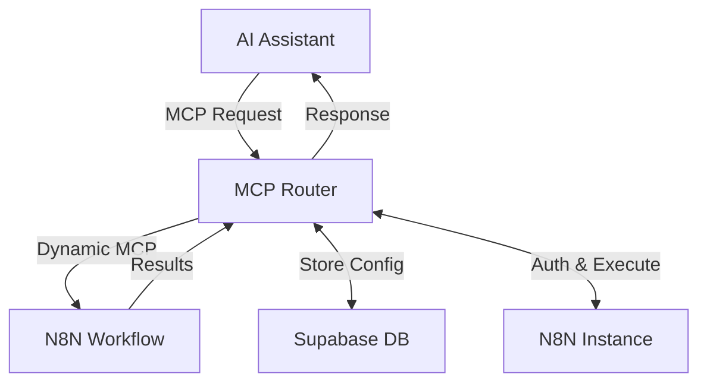

# MCP Router

**Turn your N8N workflows into AI-powered tools instantly**

MCP Router is a powerful service that converts N8N workflows into Model Context Protocol (MCP) servers, enabling seamless integration with AI assistants like Claude, Cursor, and other MCP-compatible platforms. Build custom AI tools using N8N's visual workflow editor and deploy them as callable functions for your AI assistant.

## 🚀 Key Features

- **🔄 On-Demand MCP Generation**: Dynamically creates MCP servers for N8N workflows
- **🔐 Automatic Authentication**: Handles N8N authentication using browser automation
- **🎯 Multi-Tenant Support**: Isolated MCP instances per workflow and user
- **⚡ Stateless Operation**: Fast, independent request handling
- **🛠️ RESTful Management**: Full CRUD operations for MCP registrations
- **🔒 Secure Credential Management**: Automatic handling of workflow credentials
- **🐳 Docker Ready**: Containerized deployment with all dependencies

## 🎯 Use Cases

- **Custom Data Processing**: Transform and analyze data using N8N's extensive node library
- **API Integrations**: Connect AI assistants to external services and databases
- **Workflow Automation**: Trigger complex business processes from AI conversations
- **Content Generation**: Use N8N's tools for document generation, image processing, etc.
- **Notification Systems**: Send alerts, emails, or messages based on AI interactions

## 🏗️ Architecture



## 📖 API Reference

### Register Workflow
```http
POST /n8n/build
Content-Type: application/json

{
  "workflow_id": "string",
  "user_apikey": "string"
}
```

### List Registered MCPs
```http
GET /list
```

### Remove MCP Registration
```http
POST /remove/{workflow_id}/{user_apikey}
```

### Get Workflow Credentials
```http
GET /n8n/required_credentials/{workflow_id}
```

### Check Authentication Status
```http
GET /n8n/credentials/status
```

### Access MCP Server
```
mcp://your-domain:6545/mcp/{workflow_id}/{user_apikey}
```

## 💡 Usage Examples

### Example 1: Data Analysis Workflow

1. Create an N8N workflow that:
   - Accepts input data via HTTP Request node
   - Processes data using Function or Code nodes
   - Returns formatted results

2. Register the workflow:
   ```bash
   curl -X POST "http://localhost:6545/n8n/build" \
     -H "Content-Type: application/json" \
     -d '{
       "workflow_id": "data_analyzer_123",
       "user_apikey": "my_secret_key"
     }'
   ```

3. Use in Claude Desktop (add to `claude_desktop_config.json`):
   ```json
   {
     "mcpServers": {
       "data_analyzer": {
         "command": "npx",
         "args": [
           "@modelcontextprotocol/server-fetch",
           "http://localhost:6545/mcp/data_analyzer_123/my_secret_key"
         ]
       }
     }
   }
   ```

### Example 2: Notification System

Create workflows for sending notifications and register them as MCP tools:

```bash
# Register email notification workflow
curl -X POST "http://localhost:6545/n8n/build" \
  -H "Content-Type: application/json" \
  -d '{
    "workflow_id": "email_notifier",
    "user_apikey": "notifications_key"
  }'

# Register Slack notification workflow
curl -X POST "http://localhost:6545/n8n/build" \
  -H "Content-Type: application/json" \
  -d '{
    "workflow_id": "slack_notifier", 
    "user_apikey": "notifications_key"
  }'
```

**Made with ❤️ by SUPERCHAIN team for the AI automation community**