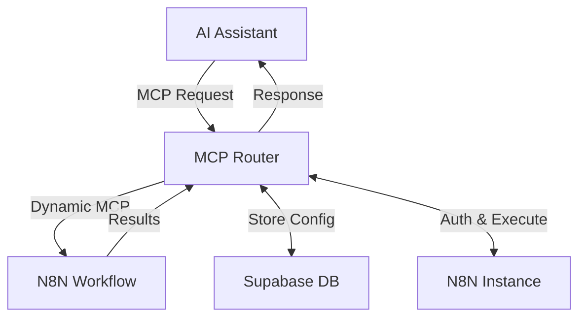

# MCP Router

**Turn your N8N workflows into AI-powered tools instantly**

MCP Router is a powerful service that converts N8N workflows into Model Context Protocol (MCP) servers, enabling seamless integration with AI assistants like Claude, Cursor, and other MCP-compatible platforms. Build custom AI tools using N8N's visual workflow editor and deploy them as callable functions for your AI assistant.

## 🚀 Key Features

- **🔄 On-Demand MCP Generation**: Dynamically creates MCP servers for N8N workflows
- **🔐 Automatic Authentication**: Handles N8N authentication using browser automation
- **🎯 Multi-Tenant Support**: Isolated MCP instances per workflow and user
- **⚡ Stateless Operation**: Fast, independent request handling
- **🛠️ RESTful Management**: Full CRUD operations for MCP registrations
- **🔒 Secure Credential Management**: Automatic handling of workflow credentials
- **🐳 Docker Ready**: Containerized deployment with all dependencies

## 🎯 Use Cases

- **Custom Data Processing**: Transform and analyze data using N8N's extensive node library
- **API Integrations**: Connect AI assistants to external services and databases
- **Workflow Automation**: Trigger complex business processes from AI conversations
- **Content Generation**: Use N8N's tools for document generation, image processing, etc.
- **Notification Systems**: Send alerts, emails, or messages based on AI interactions

## 🏗️ Architecture



## 📋 Prerequisites

- **Python 3.11+**
- **N8N Instance** (cloud or self-hosted)
- **Supabase Account** (for configuration storage)
- **Docker** (optional, for containerized deployment)

## ⚙️ Installation

### Option 1: Local Development

1. **Clone the repository**
   ```bash
   git clone https://github.com/your-org/mcp-router.git
   cd mcp-router
   ```

2. **Install dependencies**
   ```bash
   pip install -e .
   ```

3. **Install Playwright browsers**
   ```bash
   playwright install
   ```

### Option 2: Docker Deployment

```bash
docker build -t mcp-router .
docker run -p 6545:6545 --env-file .env mcp-router
```

## 🔧 Configuration

### Environment Variables

Create a `.env` file with the following variables:

```env
# N8N Configuration
N8N_INSTANCE_URL=https://your-n8n-instance.com
N8N_API_KEY=your_n8n_api_key
N8N_USERNAME=your_n8n_username
N8N_PASSWORD=your_n8n_password

# Supabase Configuration
SUPABASE_URL=https://your-project.supabase.co
SUPABASE_KEY=your_supabase_service_key

# Optional: Server Configuration
PORT=6545
HOST=0.0.0.0
```

### Database Setup

Run the database setup script to create required tables:

```bash
python setup_database.py
```

## 🚀 Quick Start

1. **Start the MCP Router**
   ```bash
   python mcp_router.py
   ```

2. **Register an N8N workflow**
   ```bash
   curl -X POST "http://localhost:6545/n8n/build" \
     -H "Content-Type: application/json" \
     -d '{
       "workflow_id": "your_workflow_id",
       "user_apikey": "your_unique_api_key"
     }'
   ```

3. **Configure your AI assistant** to use the MCP server:
   ```
   mcp://localhost:6545/mcp/your_workflow_id/your_unique_api_key
   ```

## 📖 API Reference

### Register Workflow
```http
POST /n8n/build
Content-Type: application/json

{
  "workflow_id": "string",
  "user_apikey": "string"
}
```

### List Registered MCPs
```http
GET /list
```

### Remove MCP Registration
```http
POST /remove/{workflow_id}/{user_apikey}
```

### Get Workflow Credentials
```http
GET /n8n/required_credentials/{workflow_id}
```

### Check Authentication Status
```http
GET /n8n/credentials/status
```

### Access MCP Server
```
mcp://your-domain:6545/mcp/{workflow_id}/{user_apikey}
```

## 💡 Usage Examples

### Example 1: Data Analysis Workflow

1. Create an N8N workflow that:
   - Accepts input data via HTTP Request node
   - Processes data using Function or Code nodes
   - Returns formatted results

2. Register the workflow:
   ```bash
   curl -X POST "http://localhost:6545/n8n/build" \
     -H "Content-Type: application/json" \
     -d '{
       "workflow_id": "data_analyzer_123",
       "user_apikey": "my_secret_key"
     }'
   ```

3. Use in Claude Desktop (add to `claude_desktop_config.json`):
   ```json
   {
     "mcpServers": {
       "data_analyzer": {
         "command": "npx",
         "args": [
           "@modelcontextprotocol/server-fetch",
           "http://localhost:6545/mcp/data_analyzer_123/my_secret_key"
         ]
       }
     }
   }
   ```

### Example 2: Notification System

Create workflows for sending notifications and register them as MCP tools:

```bash
# Register email notification workflow
curl -X POST "http://localhost:6545/n8n/build" \
  -H "Content-Type: application/json" \
  -d '{
    "workflow_id": "email_notifier",
    "user_apikey": "notifications_key"
  }'

# Register Slack notification workflow
curl -X POST "http://localhost:6545/n8n/build" \
  -H "Content-Type: application/json" \
  -d '{
    "workflow_id": "slack_notifier", 
    "user_apikey": "notifications_key"
  }'
```

## 🐳 Docker Deployment

### Using Docker Compose

```yaml
version: '3.8'
services:
  mcp-router:
    build: .
    ports:
      - "6545:6545"
    environment:
      - N8N_INSTANCE_URL=${N8N_INSTANCE_URL}
      - N8N_API_KEY=${N8N_API_KEY}
      - N8N_USERNAME=${N8N_USERNAME}
      - N8N_PASSWORD=${N8N_PASSWORD}
      - SUPABASE_URL=${SUPABASE_URL}
      - SUPABASE_KEY=${SUPABASE_KEY}
    restart: unless-stopped
```

Run with:
```bash
docker-compose up -d
```

## 🔐 Security Considerations

- **API Keys**: Use unique, strong API keys for each user/workflow combination
- **Environment Variables**: Never commit sensitive credentials to version control
- **Network Security**: Run behind a reverse proxy with HTTPS in production
- **Access Control**: Implement additional authentication layers as needed
- **Credential Isolation**: Each workflow's credentials are isolated and encrypted

## 🛠️ Development

### Project Structure

```
mcp_router/
├── mcp_router.py              # Main FastAPI application
├── n8n_credential_extractor.py # N8N authentication handler
├── secret_manager.py          # Credential management
├── credential_helper.py       # Workflow credential utilities
├── setup_database.py          # Database initialization
├── n8n_mcp.py                # MCP server template
├── Dockerfile                 # Container configuration
├── pyproject.toml            # Python dependencies
└── tests/                    # Test files
```

### Running Tests

```bash
# Run all tests
python -m pytest tests/

# Run specific test
python test_mcp_router.py
```

### Contributing

1. Fork the repository
2. Create a feature branch: `git checkout -b feature/amazing-feature`
3. Commit changes: `git commit -m 'Add amazing feature'`
4. Push to branch: `git push origin feature/amazing-feature`
5. Open a Pull Request

## 🚨 Troubleshooting

### Common Issues

**Authentication Failures**
- Verify N8N credentials are correct
- Check if N8N instance is accessible
- Ensure Playwright browsers are installed

**MCP Connection Issues**
- Confirm MCP Router is running on correct port
- Verify workflow_id and user_apikey are registered
- Check network connectivity to MCP Router

**Database Errors**
- Verify Supabase credentials
- Run database setup script
- Check Supabase project permissions

### Debug Mode

Enable debug logging:
```bash
export LOG_LEVEL=DEBUG
python mcp_router.py
```

## 📄 License

This project is licensed under the MIT License - see the [LICENSE](LICENSE) file for details.

## 🤝 Support

- **Issues**: [GitHub Issues](https://github.com/your-org/mcp-router/issues)
- **Discussions**: [GitHub Discussions](https://github.com/your-org/mcp-router/discussions)
- **Documentation**: [Wiki](https://github.com/your-org/mcp-router/wiki)

## 🙏 Acknowledgments

- [Model Context Protocol](https://modelcontextprotocol.io/) for the MCP specification
- [N8N](https://n8n.io/) for the amazing workflow automation platform
- [FastAPI](https://fastapi.tiangolo.com/) for the excellent web framework
- [Supabase](https://supabase.com/) for the database infrastructure

---

**Made with ❤️ by SUPERCHAIN team for the AI automation community**